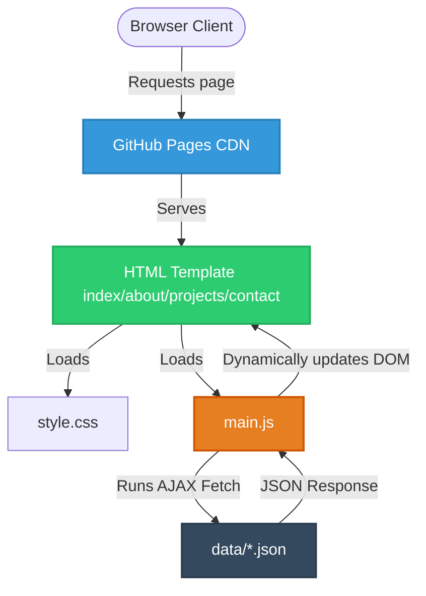

# Architecture Migration Report: Spring Boot to Static GitHub Pages

## 1. Executive Summary

This report documents the architectural audit and subsequent conversion of the Spring Boot portfolio application into a fully static, client-side rendered application deployed on GitHub Pages. 

### Why Migrate?
1. **Zero Cost**: Host pages free on GitHub Pages.
2. **Infinite Scaling**: Static assets are cached globally by GitHub's CDN. No server bottlenecks.
3. **Reduced Attack Surface**: No JVM, no active database, no SQL injection risks, and no libraries to exploit.
4. **Maintenance Overhead**: No database backups, container configurations, or server patches.

---

## 2. File Classification Matrix

Below is the file classification mapping from the original Spring Boot layout to the new static structure:

| Original File Path | Status | Target/Replacement Strategy | Rationale |
| :--- | :--- | :--- | :--- |
| `config/SecurityConfig.java` | **REMOVE** | None | GitHub Pages has no backend. Authentication must be removed. |
| `controller/AdminController.java` | **REMOVE** | None | Content management is handled via version control (Git + JSON edits). |
| `controller/PageController.java` | **REMOVE** | Direct HTML routing | Routing is resolved directly by the web server (GitHub Pages). |
| `controller/ProjectApiController.java` | **REMOVE** | Static JSON endpoints | Client-side AJAX/fetch replaces REST endpoints. |
| `model/Academic.java` | **CONVERT** | `data/academic.json` | Extracted database scheme to flat JSON structure. |
| `model/Certificate.java` | **CONVERT** | `data/certificates.json` | Extracted database scheme to flat JSON structure. |
| `model/Experience.java` | **CONVERT** | `data/experience.json` | Extracted database scheme to flat JSON structure. |
| `model/LabPlatform.java` | **CONVERT** | `data/labplatforms.json` | Extracted database scheme to flat JSON structure. |
| `model/Project.java` | **CONVERT** | `data/projects.json` | Extracted database scheme to flat JSON structure. |
| `model/Skill.java` | **CONVERT** | `data/skills.json` | Extracted database scheme to flat JSON structure. |
| `repository/*Repository.java` | **REMOVE** | `data/*.json` | JPA repositories are retired. Plain file lookups replace database calls. |
| `service/ProjectService.java` | **REMOVE** | `assets/js/main.js` | Business logic (filtering, sorting, searching) is done client-side. |
| `static/css/style.css` | **KEEP** | `assets/css/style.css` | Reusable style sheets. No changes to core styles. |
| `static/files/CV.pdf` | **KEEP** | `assets/files/Dulmina_Hasith_CV.pdf` | Static binary CV remains unchanged. |
| `static/images/avatar.jpg` | **KEEP** | `assets/images/avatar.jpg` | Static profile image remains unchanged. |
| `static/js/main.js` | **CONVERT** | `assets/js/main.js` | Upgraded to handle rendering, search, filters, and offline fallbacks. |
| `templates/*.html` | **CONVERT** | Root HTML pages | Stripped Thymeleaf tags (`th:*`). Replaced with pure semantic HTML. |
| `templates/fragments/nav.html` | **CONVERT** | Shared Navigation | Pre-rendered navbar copy inside each root page to eliminate FOUC. |
| `templates/login.html` | **REMOVE** | None | No login, dashboard, or session security required. |

---

## 3. New Architecture Diagram

The static portfolio uses a serverless, client-side rendering (CSR) architecture:

### CORS and Protocol Limitations
A typical problem in client-side applications is the Same-Origin Policy (SOP). When running the site via the `file://` protocol (e.g. double clicking HTML files in file explorers), browsers restrict `fetch()` requests. 

To overcome this, `main.js` defines an inline fallback structure (`FALLBACK_DATA`). If a fetch fails, the app catches the exception and immediately switches to fallback data, ensuring the application remains 100% operational offline.

---

## 4. Architectural Tradeoffs

### 1. Security Config Removal
* **Tradeoff**: Anyone can view the frontend code, and there is no login.
* **Impact**: Positive. This is a public portfolio. Retaining Spring Security only added configuration drag and dependency risk (such as log4j or spring-security CVE vulnerabilities).

### 2. No Admin Controller
* **Tradeoff**: Adding projects now requires editing JSON files and executing a git push, instead of filling in a form on a dashboard.
* **Impact**: Positive. Git serves as a version-controlled content management system. Code quality is checked via pull requests and deploy tests. It prevents unauthorized database edits.

### 3. Contact Form Backend Removal
* **Tradeoff**: Forms cannot process emails natively without a mail server.
* **Impact**: Replaced by **Formspree**. Standard, secure POST endpoint that handles captcha verification, spam filters, and sends submissions straight to your inbox without coding a mail relay.
